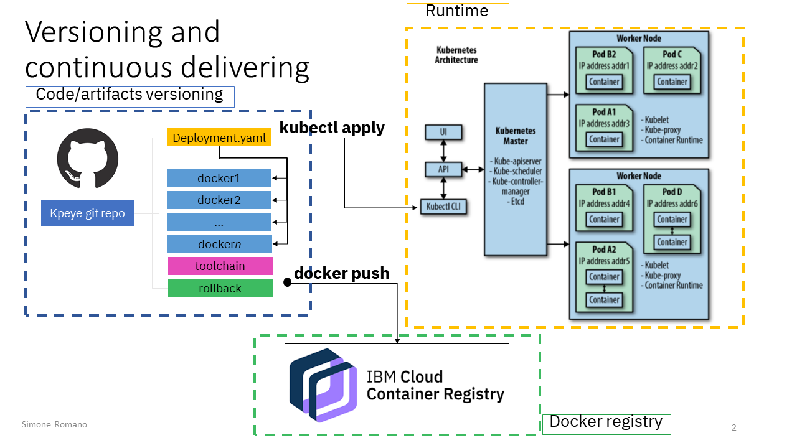

# kubedev: a continuous delivery Standard for your K8s workloads on IBM Cloud

*kubedev* is a standard that allows you to easily deploy your applications to Kubernetes on IBM Cloud with a continuous delivery approach. The benefits you have using this approach are listed below:

1) **automatic versioning of each components of your application**: for example, if you are designing and devolping a microservices application for Kubernetes, you can use this approach to simply deploy and versioning each component of your application without the need to be a devops specialist

2) **the developers team does not need to be a Kubernetes specialist to deploy the applications to Kubernetes**: your developers team must just write code and click a button to do versioning, deploy, add a new microservice

The used components are: 

1) GitHub: the code and artifacts are pushed to GitHub 

2) IBM Container Registry: the built docker images are pushed to IBM Cloud Container Registry 

3) Toolchain: Toolchains service allows you to deploy a new version of your microservices application to Kubernetes 

## How is the lecture organized
This lecture is organized as follow:

1) **kubedev concepts**: the first section gives you the theory basis you need to understand how the *kubedev* standard works and how to build your custom Kubernetes application using this standard
2) **Build your first *kubedev* microservices application**: here a simple scenario of *kubedeb* application is shown; you can follow the steps in this section to build your first *kubedev* application

# kubedev concepts

## Repository organization

In a microservices application you will have many applications to version and to deploy on your runtime (ex. Kubernetes cluster). For related microservices, the *kubedev* standard organizes the repository as shown in the following figure: each microservice is an application to dockerize; you must create a folder for each docker in your solution and a global *deployment.yaml* file that describe your dockers interaction and allows you to deploy the solution to Kubernetes. 



To define your *deployment.yaml* you need to have a knowledge of Kubernetes objects (Pod, Deployment, ReplicaSet, Service, etc.). You can use the *[kubernetes](https://kubernetes.io/docs/concepts/overview/working-with-objects/kubernetes-objects/)* official documentation to better understand these concepts.

Note that, in the *deployment.yaml*, you must tag each of your docker image with *:BUILD_NUMBER*: the toolchain script will update this tag with an incremental value and will version each of your docker image with this value to the docker registry. More details below.


The *toolchain* folder contains the script you will copy and paste in your toolchain (see next steps for more details). Finally, the *rollback* folder will automatically be populated with a new *deployment.yaml* file after each deploy you will do; you can revert your applications to a previous version by applying (*kubectl apply -f ...*) to your cluster a specific version of your application.


## Continuous delivery pipeline


The previous image describes the continuous delivery pipeline from the repository and runtime point of view. The image describes a real scenario where there are two different Kubernetes cluster, one for dev/test environment and another one for production environment. The GitHub repository contain three branches, one for each environment. Three different toolchain pipelines get in input a different branch and deploy the application to different Kubernetes cluster. 

A toolchain, in this scenario, has two different stage: build and deploy. The build stage is responsible for: build each application docker to IBM Cloud Container Registry; generate and push a new deployment file with the new built docker images; create a new git tag to have a *label* for this specific deploy (useful for rollback scenario). The deploy stage get in input the *deployment.yaml* file and publish it to Kubernetes runtime; here the new version of your application is deployed. 

In the next scenario we have just one git branch and one Kubernetes cluster, but the concepts are the same. 


# Build your first *kubedev* microservices application

## System description

We will build a simple web application composed by two different components (frontend and backend) and will deploy the application to IBM Cloud Kubernetes Service using the *kubedev* standard.

## Technology stack


## Architectural Diagram
The main system components are: 

1) Backend application: Python Flask multi-instance microservice that will expose the */data/message* REST service; it returns the "Welcome to kubedev!" message

2) Frontend application (K8s): Node.js application on Kubernetes; this application consists in a simple button that you can click to interact with the backend application

3) IBM Container Registry: the frontend and backend application runtime have been dockerized and pushed to IBM Container Registry 

   


# Getting started

This step-by-step guide will allows you to create a multi-cloud online payment system. The cloud providers we will use are IBM Cloud and AWS. So, you must create an account for each cloud provider.

<b>NB</b>: all the used tools are free (they have a lite plan that we will use for this demo); anyway, for the AWS (optional) component, you must add your credit card in order to complete the AWS account confirmation.

### Step 1 - IBM Cloud account creation
Create an IBM Cloud account: follow the guide at <a href='https://cloud.ibm.com/registration'>this</a> url to complete the registration

### Step 2 - Services provisioning
Provisioning of the IBM Services we will use in the rest of the guide; in particular:

<ol>
<li> Kubernetes cluster: click <a href='https://cloud.ibm.com/kubernetes/catalog/cluster'>here</a>, click <i>create</i> and select the free plan (1 worker node - 2 vCPUs 4GB RAM)
<li> Db2: click <a href='https://cloud.ibm.com/catalog/services/db2'>here</a> and follow the instructions to create a Db2 instance with the lite plan (200 MB of data storage, 5 simultaneous connections, shared multitenant system)
<li> Continuous Delivery Service: click <a href='https://cloud.ibm.com/catalog/services/continuous-delivery'>here</a> and follow the instructions to instantiate a Continuous Delivery service with lite plan
</ol>

### Step 3 - DB creation
In this step we will create a simple DB schema that will allows our backend application to write data (payment transactions) to Db2.

<ol>
<li> From your IBM Cloud console, open the Db2 service
<li> From the left menu, click "Service Credentials"
<li> Create new credenitals by clicking to the "New Credentials" button
<li> Use your favorite jdbc client to connect to your Db2 instance using the credentials you generated (Host, Port, Database, Username and password)
</ol>

Clone this repository in your favorite folder. Using your favourite jdbc client, run the queries in the <i>src/db2/ 	db_Cloud4Banking.sql</i>. 
The following ER diagram shows the simple tables you will have in your database.


### Step 4 - Toolchain setup
In this step you will setup the toolchain that will allows you to deploy the solution to Kubernetes in IBM cloud.

#### Registry configuration
<ol>
<li> From your IBM Cloud console, open the left menu and click <i>Kubernetes</i>
<li> Open the <i>Registry</i> submenu and follow the instruction to create a new namespace with the name <i>cloud4bnakinc</i>
</ol>

#### Integration tools
<ol>
<li> From your IBM Cloud console, open the Continuous Delivery Service you created in Step 2
<li> In the <i>Getting Started</i> section, click <i>Create a toolchain</i>
<li> From the menu, click <i>Build your own toolchain</i>
<li> In the <i>Toolchain name</i> type <i>cloud4banking</i>
<li> Click <i>Create</i>
<li> Click <i>Add a tool</i>
<li> Click <i>GitHub Enterprise Whitewater</i>
<li> In the <i>Repository type</i>, select <i>Existing</i>
<li> In the <i>Repository URL</i>, type <i>https://github.ibm.com/Simone-Romano1/Cloud4Banking</i>
<li> Click <i>Create integration</i>
<li> Click <i>Add a tool</i>
<li> Click <i>Delivery Pipeline</i>
<li> In the <i>Pipeline name</i> type <i>cloud4banking</i>
</ol>

The following image shows the configured integration tools:


#### Toolchain stages configuration
##### Build stage
<ol>
<li> Click on the <i>Delivery Pipeline</i> tool
<li> Click <i>Add Stage</i>
<li> Set the stage name to <i>Build</i>
<li> In the <i>Stage trigger</i> section, select <i>Run jobs only when this stage is run manually</i>
<li> From the stage menu, switch to <i>Jobs</i> section
<li> As <i>Builder type</i>, select <i>Container Registry</i>
<li> Enter an API Key (use <a href='https://cloud.ibm.com/docs/iam?topic=iam-serviceidapikeys#create_service_key'>this</a> guide to generate an API Key)
<li> In the <i>Build script</i>, paste the content of the <i>src/toolchain/build.txt</i> script
<li> Click <i>Save</i>
</ol>

##### Deploy stage
<ol>
<li> Click on the <i>Delivery Pipeline</i> tool
<li> Click <i>Add Stage</i>
<li> Set the stage name to <i>Deploy</i>
<li> Set the <i>Input type</i> to <i>Build Artifacts</i>
<li> Set the <i>Stage trigger</i> to <i>Run jobs when the previous stage is completed</i>
<li> Switch to <i>Job</i> tab
<li> Set <i>Kubernetes</i> as <i>Deployer Type</i>
<li> Add the API Key as in the previous step
<li> Check that you see your cluster in the <i>Cluster name</i>
<li> In the <i>Deploy script</i>, paste the content of the <i>src/toolchain/deploy.txt</i> script
<li> Click <i>Save</i>
</ol>

### Step 5 - Deploy
The following picture shows the configured delivery pipeline:


Click the <i>Play</i> button on the Build phase to deploy the application.
<br>
The deploy result will be:
<ol>
<li> Upload of 2 docker images on your IBM Cloud Container Registry
You can see the result of this operation by navigating to <i>Kubernetes/Registry</i> section in your IBM Cloud account dashboard


<li> Deploy of the applications to Kubernetes cluster
</ol>

Open the Kubernetes dashboard to see the up and running applications.


You will have 2 Kubernetes services, one for the frontend component and the other one for the backend component.


You can access the frontend component with this url:

http://[YOUR_WORKERNODE_PUBLIC_IP]:30037/

The home page you will see is the following:


You can change the <i>amount</i> value and click <i>Pay</i> to simulate a payment. The frontend application will interact with the backend to submit a transaction to the Db2 service.

<br>
After you complete a transaction, you can see the new row in the Db2 by using your favourite jdbc client and running the following query:

```sql
SELECT * FROM DNQ01238.PAYMENT;
``` 

### Step 6 - External User AWS frontend
The last step shows the simplicity to integrate your cloud application with external systems; in this case, we will integrate our backend system with a frontend application running on AWS.
<br>

#### Create an AWS Account
Follow the guide at <a href="https://aws.amazon.com/premiumsupport/knowledge-center/create-and-activate-aws-account/">this</a> link to create an AWS Account

#### Create an EC2 instance
<ol>
<li> Access to your AWS account
<li> From the <i>Service</i> menu, click <i>EC2</i>
<li> Click <i>Launch Instance</i>
<li> Select the <i>Amazon Linux AMI 2018.03.0 (HVM), SSD Volume Type</i> (free tier eligible)
<li> Click <i>Review and launch</i>
<li> Generate and store a new Key Pair
<li> Click <i>Launch Instances</i>
<li> Use the guid at <a href="https://docs.aws.amazon.com/AWSEC2/latest/UserGuide/AccessingInstancesLinux.html">this</a> link to access the EC2 instance via ssh
<li> Switch to sudo user (<i>sudo su</i>)
<li> Copy the <i>src/ec2/setup.sh</i> script to the EC2 machine
<li> Run <i>sh setup.sh</i>
<li> clone this repository to your EC2
<li> Move to the <i>frontend_internal</i> folder (<i>cd src/frontend_internal</i>)
<li> Run <i>npm install</i> 
<li> Run <i>nohup npm start &</i> to start the application on EC2
<li> From the EC2 dashboard on AWS, click <i>Security Groups</i>
<li> Add a Custom inbound rule in the default security group to allow the inbound to the port 3000
<li> If not present, add the SSH inbound rule


<li> Open your browser and follow the <i>http://[EC2 Public DNS]:3000</i> to navigate to the <i>frontend_internal</i> application
</ol>

You will see the following page:


### Step 7 - enjoy!
To try the application:
<ol>
<li> Open the <i>frontend external</i> application
<li> Submit a payment
<li> Open the <i>frontend internal</i> application
<li> Refresh by using the <i>Click to reload</i> button
<li> You will see the new payment
</ol>

### End
Congratulations! Now you are a ready to design your applications with a <i>multi-cloud-native</i> approach.