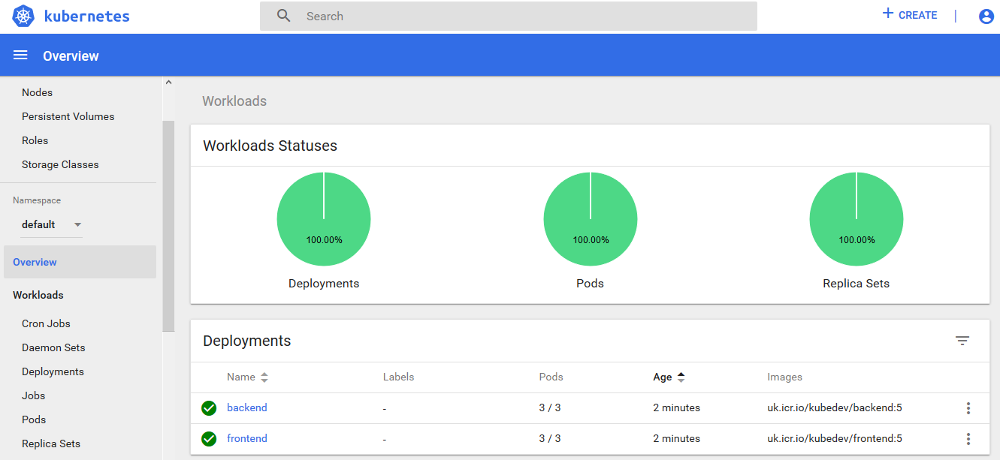

# kubedev: a continuous delivery Standard for your K8s workloads

*kubedev* is a standard that allows you to easily deploy your applications to Kubernetes with a continuous delivery approach. The benefits you have using this approach are listed below:

1) **automatic versioning of each components of your application**: for example, if you are designing and devolping a microservices application for Kubernetes, you can use this approach to simply deploy and versioning each component of your application without the need to be a devops specialist

2) **the developers team does not need to be a Kubernetes specialist to deploy the applications to Kubernetes**: your developers team must just write code and click a button to do versioning, deploy, add a new microservice

The used components are: 

1) GitHub: the code and artifacts are pushed to GitHub 

2) IBM Container Registry: the built docker images are pushed to IBM Cloud Container Registry 

3) Toolchain: Toolchains service allows you to deploy a new version of your microservices application to Kubernetes 

<b>N.B.: the <i>kubedev</i> concepts can be extended to also other Cloud providers or to your on-premises Kubernetes infrastructure.</b>

## How is the lecture organized
This lecture is organized as follow:

1) **kubedev concepts**: the first section gives you the theory basis you need to understand how the *kubedev* standard works and how to build your custom Kubernetes application using this standard
2) **Build your first *kubedev* microservices application**: here a simple scenario of *kubedeb* application is shown; you can follow the steps in this section to build your first *kubedev* application

# kubedev concepts

## Repository organization

In a microservices application you will have many applications to version and to deploy on your runtime (ex. Kubernetes cluster). For related microservices, the *kubedev* standard organizes the repository as shown in the following figure: each microservice is an application to dockerize; you must create a folder for each docker in your solution and a global *deployment.yaml* file that describe your dockers interaction and allows you to deploy the solution to Kubernetes. 


To define your *deployment.yaml* you need to have a knowledge of Kubernetes objects (Pod, Deployment, ReplicaSet, Service, etc.). You can use the *[kubernetes](https://kubernetes.io/docs/concepts/overview/working-with-objects/kubernetes-objects/)* official documentation to better understand these concepts.

Note that, in the *deployment.yaml*, you must tag each of your docker image with *:BUILD_NUMBER*: the toolchain script will update this tag with an incremental value and will version each of your docker image with this value to the docker registry. More details below.


The *toolchain* folder contains the script that will do the continuous delivery tasks for you (see next sections for more details). Finally, the *rollback* folder will automatically be populated with a new *deployment.yaml* file after each deploy you will do; you can revert your applications to a previous version by applying (*kubectl apply -f ...*) to your cluster a specific version of your application.


## Continuous delivery pipeline


The previous image <i>kubedev </i> continuous delivery pipeline from the repository and runtime point of view. The image describes a real scenario where there are two different Kubernetes cluster, one for dev/test environment and another one for production environment. The GitHub repository contain three branches, one for each environment. Three different toolchain pipelines get in input a different branch and deploy the application to different Kubernetes cluster. 

The <i>kubedev</i> toolchain, in this scenario, has two different stage: build and deploy. <br>
<ol>
<li>The <b>build</b> stage is responsible for: 
<ol>
<li> build each application docker to IBM Cloud Container Registry
<li> generate and push a new deployment file with the new built docker images
<li> create a new git tag to have a *label* for this specific deploy (useful for rollback scenario). 
</ol>
</li>The <b>deploy</b> stage get in input the *deployment.yaml* file and publish it to Kubernetes runtime; here the new version of your application is deployed. 
</ol>

In the next scenario we have just one git branch and one Kubernetes cluster, but the concepts are the same. 


# Build your first *kubedev* microservices application

## System description

We will build a simple web application composed by two different components (frontend and backend) and will deploy the application to IBM Cloud Kubernetes Service using the *kubedev* standard.

## Technology stack


## Architectural Diagram
The main system components are: 

1) Backend application: Python Flask multi-instance microservice that will expose the */data/message* REST service; it returns the "Welcome to kubedev!" message

2) Frontend application (K8s): Node.js application on Kubernetes; this application consists in a simple button that you can click to interact with the backend application

3) IBM Container Registry: the frontend and backend application runtime have been dockerized and pushed to IBM Container Registry 

   


The image below shows the frontend of the application we will build:


## Getting started

This step-by-step guide will allows you to create a simple web application applying the *kubedeb* standard.

<b>NB</b>: all the used tools are free (they have a lite plan that we will use for this demo)

### Step 1 - IBM Cloud account creation
Create an IBM Cloud account: follow the guide at <a href='https://cloud.ibm.com/registration'>this</a> url to complete the registration

### Step 2 - Services provisioning
Provisioning of the IBM Services we will use in the rest of the guide; in particular:

<ol>
<li> Kubernetes cluster: click <a href='https://cloud.ibm.com/kubernetes/catalog/cluster'>here</a>, click <i>create</i> and select the free plan (1 worker node - 2 vCPUs 4GB RAM)
<li> Continuous Delivery Service: click <a href='https://cloud.ibm.com/catalog/services/continuous-delivery'>here</a> and follow the instructions to instantiate a Continuous Delivery service with lite plan
</ol>

### Step 3 - Toolchain setup
In this step you will setup the toolchain that will allows you to deploy the solution to Kubernetes in IBM cloud.

#### Registry configuration
<ol>
<li> From your IBM Cloud console, open the left menu and click <i>Kubernetes</i>
<li> Open the <i>Registry</i> submenu and follow the instruction to create a new namespace with the name <i>kubedev</i>
</ol>

#### Integration tools
<ol>
<li> From your IBM Cloud console, open the Continuous Delivery Service you created in Step 2
<li> In the <i>Getting Started</i> section, click <i>Create a toolchain</i>
<li> From the menu, click <i>Build your own toolchain</i>
<li> In the <i>Toolchain name</i> type <i>kubedev</i>
<li> Click <i>Create</i>
<li> Click <i>Add a tool</i>
<li> Click <i>GitHub Enterprise Whitewater</i>
<li> In the <i>Repository type</i>, select <i>Existing</i>
<li> In the <i>Repository URL</i>, type <i>https://github.com/sromano1992/kubedev/i>
<li> Click <i>Create integration</i>
<li> Click <i>Add a tool</i>
<li> Click <i>Delivery Pipeline</i>
<li> In the <i>Pipeline name</i> type <i>kubedev</i>
</ol>

The following image shows the configured integration tools:


#### Toolchain stages configuration
##### Build stage
<ol>
<li> Click on the <i>Delivery Pipeline</i> tool
<li> Click <i>Add Stage</i>
<li> Set the stage name to <i>Build</i>
<li> In the <i>Stage trigger</i> section, select <i>Run jobs only when this stage is run manually</i>
<li> From the stage menu, switch to <i>Jobs</i> section
<li> As <i>Builder type</i>, select <i>Container Registry</i>
<li> Enter an API Key (use <a href='https://cloud.ibm.com/docs/iam?topic=iam-serviceidapikeys#create_service_key'>this</a> guide to generate an API Key)
<li> As <i>Container Registry namespace</i> choose <i>kubedev</i>
<li> In the <i>Build script</i>, paste the following content:

```
#!/bin/bash
sh toolchain/build.sh
```

<li> Click <i>Save</i>
</ol>

##### Deploy stage
<ol>
<li> Click on the <i>Delivery Pipeline</i> tool
<li> Click <i>Add Stage</i>
<li> Set the stage name to <i>Deploy</i>
<li> Set the <i>Input type</i> to <i>Build Artifacts</i>
<li> Set the <i>Stage trigger</i> to <i>Run jobs when the previous stage is completed</i>
<li> Switch to <i>Job</i> tab
<li> Set <i>Kubernetes</i> as <i>Deployer Type</i>
<li> Add the API Key as in the previous step
<li> Check that you see your cluster in the <i>Cluster name</i>
<li> In the <i>Deploy script</i>, paste the following content:

```
#!/bin/bash
sh toolchain/deploy.sh
```

<li> Click <i>Save</i>
</ol>

### Step 5 - Deploy
The following picture shows the configured delivery pipeline:


Click the <i>Play</i> button on the Build phase to deploy the application.
<br>
The deploy result will be:
<ol>
<li> Upload of 2 docker images on your IBM Cloud Container Registry
You can see the result of this operation by navigating to <i>Kubernetes/Registry</i> section in your IBM Cloud account dashboard


<li> Deploy of the applications to Kubernetes cluster
</ol>

Open the Kubernetes dashboard to see the up and running applications.


You will have 2 Kubernetes services, one for the frontend component and the other one for the backend component.


You can access the frontend component with this url:

http://[YOUR_WORKERNODE_PUBLIC_IP]:30037/

The home page you will see is the following:


### Step 6 - enjoy!
To try the application:
<ol>
<li> Open the <i>frontend</i> application
<li> click on the <i>Call backend</i> button
<li> You will see the <i>Welcome to kubedev!</i> message: your frontend and backend applications are able to interact
</ol>

## End
Congratulations! Now you are a ready to design your applications with the <i>kubedev</i> approach.